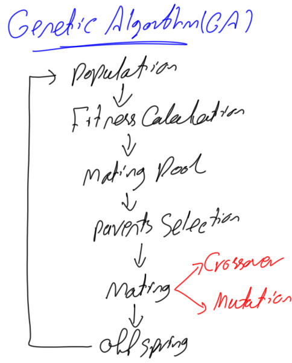

# Generic Genetic_algorithm

classes and inheritance, reusability of code ...

## Description

```md
    
    ```
Genetic algorithms are a class of algorithms that take inspiration from genetics. More specifically, “genes” evolve over
several iterations by both crossover (reproduction) and mutation.It’s basically make x guesses, create y hybrid guess,
evaluate the fitness of the gene pool and do some pruning. Rinse and repeat until you converge on a solution. The Reader
should have a basic understanding of how GA works. If not, please read this article titled “Introduction to Optimization
with Genetic Algorithm” found in these links:

* KDnuggets: https://www.kdnuggets.com/2018/03/introduction-optimization-with-genetic-algorithm.html
* TowardsDataScience: https://towardsdatascience.com/introduction-to-optimization-with-genetic-algorithm-2f5001d9964b

## Table of contents

* [General info](#general-info)
* [Requirements](#technologies)
* [Setup](#setup)
* [Credits](#Credits)

## General info

in this project we treated two uses cases : "traveling salesman problem”" and "the MasterMind game" to illustrate how
the genetic algorithm can solve some real life problems. To solve a Genetic

## Credits

https://towardsdatascience.com/genetic-algorithm-implementation-in-python-5ab67bb124a6
https://coding-boot-camp.github.io/full-stack/github/professional-readme-guide
