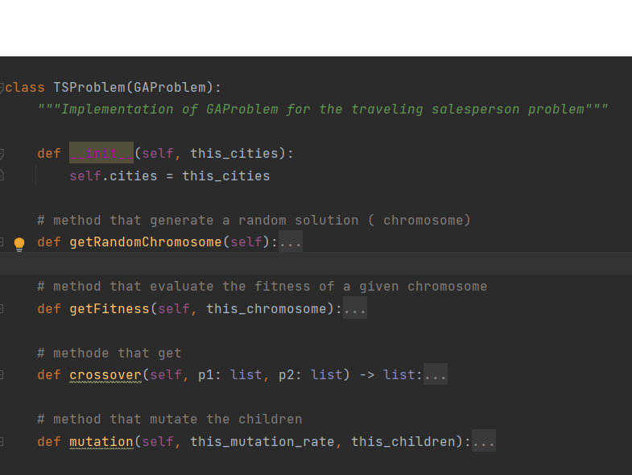

# Generic Genetic_algorithm

classes and inheritance, reusability of code ...

## Description

Genetic algorithm is a way of finding a solution to a problem, inspired by biology and evolution.. “genes” evolve over
several iterations by both crossover (reproduction) and mutation. It’s basically make x guesses, create y hybrid guess,
evaluate the fitness of the gene pool and do some pruning. Rinse and repeat until you converge on a solution. The Reader
should have a basic understanding of how GA works. If not, please read this article titled “Introduction to Optimization
with Genetic Algorithm” found in these links:

* [KDnuggets](https://www.kdnuggets.com/2018/03/introduction-optimization-with-genetic-algorithm.html)
* [TowardsDataScience](https://towardsdatascience.com/introduction-to-optimization-with-genetic-algorithm-2f5001d9964b)

the purpose of this project is to standardize a methodology to compute some genetic problem, and reduce the amount of
code redundancy.

## Table of contents

* [General info](#general-info)
* [Usage](#Usage)
* [Requirements](#Requirements)
* [Credits](#Credits)

## General info

in this project we treated two uses cases : "traveling salesman problem”" and "the MasterMind game" to illustrate how
the genetic algorithm can solve some real life problems and to showcase how the GasSolver module work. first here a
broad view of how to decompose a generic genetic problem for a better understanding :

1. **Generate** a **bunch of solutions**, likely random ones.
2. **Fitness**: *Assess* how good they are.
3. **crossover** : Pick some that will be used to create new, ideally better, solutions.
4. **Create pairs** from the selected bunch. Each pair will produce two new solutions.
5. **mutation** : Make small random changes, with some probability, to the newly created solutions.
6. Replace the previous bunch with the newly created solutions.
7. Keep going till a perfect solution is found, you’re finally bored, or you have reached the heat death of the
   universe.

## Usage

to solve a Genetic problem with the GASolver_module you need to :

* create functions that handles :  the generations of random solution, asses the fitness of a chromosome, the crossover
  and the mutation in the context of your genetic problem.
* create a class that take the GAProblem as a Parent and define the function that handles and respect the same naming as
  shown below :  
  
* setup your main accordingly to solve the problem

## Requirements

## Credits

[towardsDatascience](https://towardsdatascience.com/genetic-algorithm-implementation-in-python-5ab67bb124a6)
[Hillary Nyakundi](https://www.freecodecamp.org/news/how-to-write-a-good-readme-file/)
